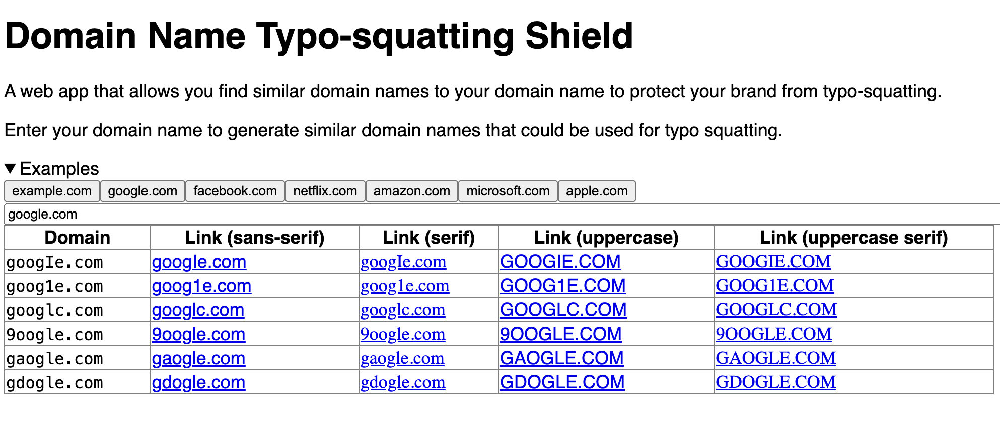

# Domain name typo-squatting shield

A web app that helps you find similar domain names to your domain name to protect your brand from typo-squatting.

## Features

- Allows users to search for similar domain names to their domain name by typing in their domain name.
- Allows users to see a table of similar domain names to their domain name.
- Does not allow users to see domain names that are invalid.

## Screenshots

## Acknowledgements

A list of country codes TLDS.md
https://gist.github.com/derlin/421d2bb55018a1538271227ff6b1299d
